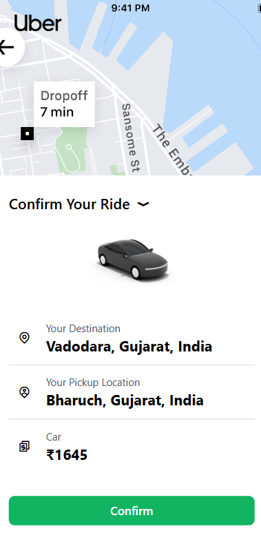

# Uber Clone - User Side

This project is a clone of the Uber application, focusing on the user side functionalities. It is built using React and Vite.

## Pages

### Start

### User Login

### User Signup

### Home

### Location Panel

### Choose Ride

### ConfirmRide

### Waiting For Captain

### Captain Login

### Captain Signup

### Captain Home

### Captain Riding

### Captain Confirm Ride Panel

### End Ride

## Setup

This template provides a minimal setup to get React working in Vite with HMR and some ESLint rules.

Currently, two official plugins are available:

- [@vitejs/plugin-react](https://github.com/vitejs/vite-plugin-react/blob/main/packages/plugin-react/README.md) uses [Babel](https://babeljs.io/) for Fast Refresh
- [@vitejs/plugin-react-swc](https://github.com/vitejs/vite-plugin-react-swc) uses [SWC](https://swc.rs/) for Fast Refresh
